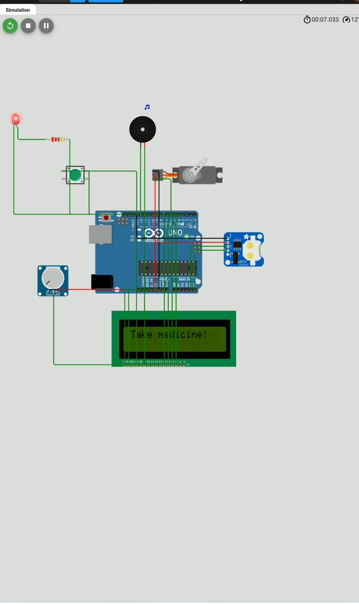

# Automatic Medicine Dispenser with Alert System

## Project Overview
The Automatic Medicine Dispenser with Alert System is an IoT-based healthcare device designed to remind patients to take medicines on time. The system provides alerts and can automatically dispense medicine at scheduled times.
This project helps elderly people and patients who often forget their medication schedule.

## Features
• Automatic medicine dispensing  
• Time-based reminder system  
• Alert notification using buzzer  
• Easy to use system  
• Helps improve medication adherence  

## Hardware Components
- ESP32 / Arduino
- RTC Module
- Servo Motor
- Buzzer
- LCD Display
- Push Buttons
- Power Supply

  ## Wokwi Simulation
[Run the Simulation on Wokwi](https://wokwi.com/projects/433921106885273601)

## Circuit diagram 

## Working Principle
1. The user sets the medicine time.
2. The RTC module keeps track of real time.
3. When the scheduled time arrives, the system triggers an alert.
4. The servo motor dispenses the medicine.
5. The buzzer notifies the patient.

## Applications
- Hospitals
- Home healthcare
- Elderly patient monitoring

## Future Improvements
- Mobile app integration
- SMS notification
- Voice reminder system
